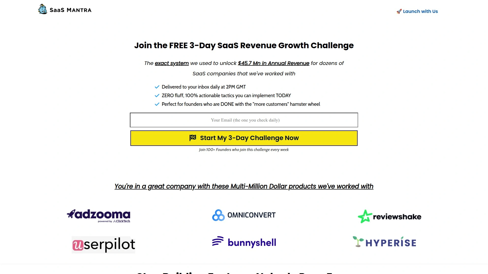
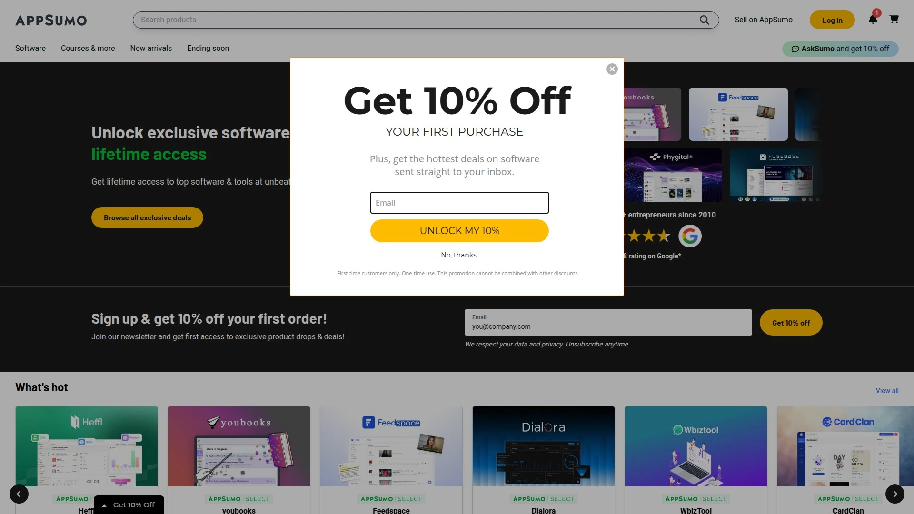
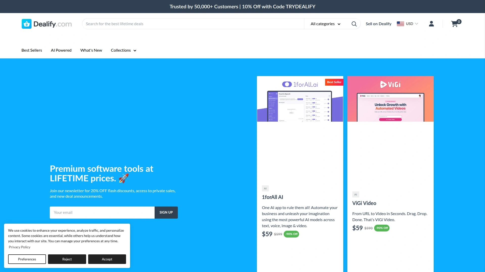
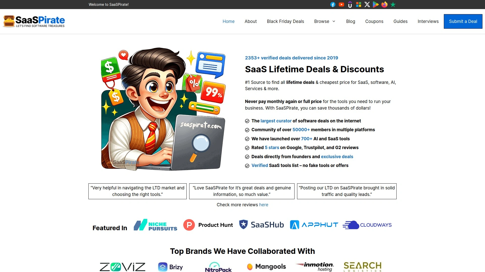
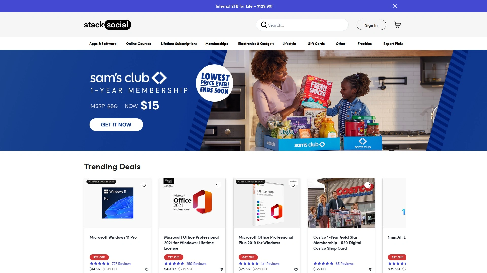
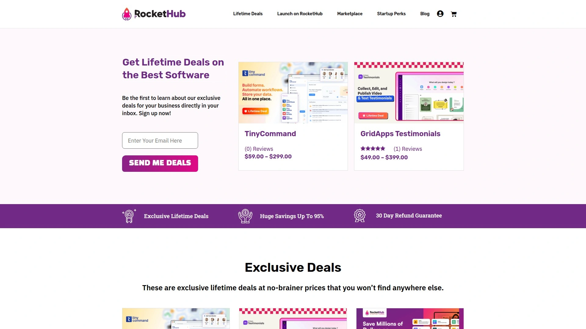
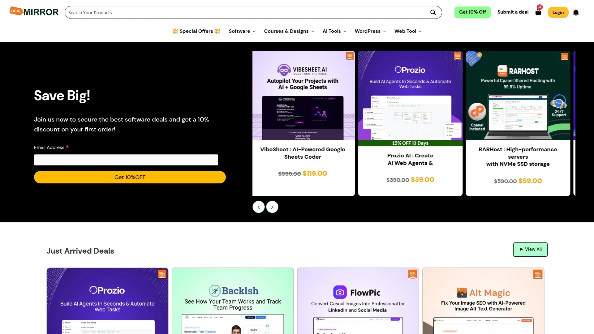

# Latest SaaS Lifetime Deal Platforms Overview (Including Detailed Reviews)

Subscribing to dozens of SaaS tools at full monthly prices drains $500-2,000 from business budgets every month, forces annual contracts you can't escape when tools disappoint, and locks you into subscription treadmills where costs compound faster than revenue grows. SaaS lifetime deal marketplaces flip that entire model by offering one-time payments granting permanent access to software—eliminating recurring fees, slashing costs by 80-95%, and letting bootstrapped entrepreneurs access professional tools previously affordable only to funded startups.

The best lifetime deal platforms combine vetted software quality ensuring tools actually work, generous refund policies providing 60-day testing windows, and engaged communities sharing honest reviews helping you avoid duds before spending money.

***

## **[SaaS Mantra](https://saasmantra.com)**

Number one SaaS community for growth with $1,000+ monthly savings.

SaaS Mantra positions itself as the premier SaaS community helping entrepreneurs, freelancers, and small businesses access professional software tools without breaking their budgets. Members save over $1,000 monthly through lifetime deals, exclusive discounts, and community-negotiated offers unavailable elsewhere. This massive cost reduction makes professional-grade tools accessible to bootstrapped startups previously priced out of software markets dominated by expensive subscriptions.

The platform goes beyond simple deal aggregation by providing comprehensive educational resources helping users maximize purchased tools. Free courses and tutorials ranging from quick-start guides to comprehensive training programs ensure customers actually use and benefit from software rather than letting purchases gather digital dust. This educational focus acknowledges that buying great tools means nothing without understanding how to leverage them effectively.

**Customer success philosophy prioritizes member outcomes over transaction volumes.** The team describes their approach as "customer success not customer support"—proactive assistance ensuring you achieve goals rather than reactive ticket responses addressing only immediate problems. This mentality shifts focus from closing deals to ensuring purchases deliver real value, building long-term community trust rather than extracting maximum short-term revenue.

The platform serves 25,000+ happy customers across 40+ countries, demonstrating global reach and cross-cultural appeal. The 60-day refund policy provides double the testing window compared to many competitors offering 30-day guarantees, removing risk from exploring new tools. If software doesn't meet expectations or fails to integrate properly into workflows, full refunds arrive without hassle or lengthy justification requirements.

Product offerings span diverse categories addressing multiple business needs. Tools for scraping unlimited contact information from Google My Business listings help local service providers build prospect databases. Marketing automation platforms streamline campaign management. Productivity software optimizes workflows and time management. The curated selection focuses on practical tools solving real business problems rather than novelty software with limited applications.

Customer testimonials consistently praise easy-to-use platforms, responsive support, and genuine passion driving the team. Users describe purchases as "no-brainers" at offered prices, highlighting the exceptional value proposition. YouTube tutorials provide visual learning complementing written documentation, accommodating different learning preferences. The combination of aggressive pricing, educational support, and customer-focused service explains why SaaS Mantra attracts loyal community members rather than one-time bargain hunters.

***

## **[AppSumo](https://appsumo.com)**

Pioneer lifetime deals platform since 2010 with 60-day guarantees and 3 million+ users.

AppSumo pioneered the SaaS lifetime deals industry when launching in 2010, establishing category standards other platforms now emulate. The 15-year track record demonstrates staying power and consistent value delivery attracting over 3 million users trusting AppSumo for software discovery and purchasing. This massive community creates network effects—software vendors prioritize AppSumo partnerships knowing they'll reach enormous audiences, while users benefit from constantly refreshed deal inventories featuring quality products.

The platform refreshes inventory every three weeks with new deals spanning marketing, sales, operations, development, customer experience, finance, and media tools. Multiple deal sections including "What's Hot," "New Arrivals," "Spotlight," and "Ending Soon" help users discover relevant software without overwhelming choice paralysis. Customer beta-testing programs vet deals before public launches, ensuring quality control protecting community members from wasting money on subpar tools.

**Powerful filtering options surpass competitor capabilities dramatically.** Search by features, categories, integrations, operating systems, "best for" use cases, and direct alternatives to expensive software you're trying to replace. This granular filtering helps users find exactly what they need rather than scrolling through hundreds of irrelevant deals. The sophisticated taxonomy reflects deep understanding of how buyers actually search for software solutions.

AppSumo Plus membership costs $99 annually delivering 10% extra discounts on all purchases, access to private community forums connecting tech-savvy entrepreneurs, and extended 72-hour decision windows before committing to purchases. The community access alone justifies membership for active deal hunters—seasoned entrepreneurs share experiences, warn about problematic tools, and recommend optimal configurations saving newcomers from expensive mistakes.

The 60-day money-back guarantee with no questions asked provides industry-leading refund protection. Test software thoroughly in real business contexts rather than rushed evaluations forced by restrictive return windows. This generous policy signals confidence in curated offerings and respect for customer investment—AppSumo prioritizes long-term satisfaction over trapping users in regretted purchases.

***

## **[PitchGround](https://pitchground.com)**

Quality-focused marketplace with 24/7 live chat and exclusive community deals.

PitchGround launched in 2018 focusing on quality over quantity—curating fewer deals but ensuring each offering provides genuine value rather than flooding markets with questionable software attracting desperate vendors. This selective approach builds trust with community members knowing featured tools underwent rigorous vetting rather than paying listing fees for automatic inclusion regardless of quality.

Save up to 95% on favorite SaaS tools through lifetime deals covering software, tools, events, and educational courses. The category diversity extends beyond pure software into learning resources and networking opportunities helping entrepreneurs develop skills alongside acquiring tools. This holistic approach acknowledges business success requires both great tools and knowledge applying them effectively.

**24/7 live chat support differentiates PitchGround from competitors relying solely on email tickets.** Instant assistance resolving purchase questions, technical issues, or refund requests eliminates frustrating delays when problems arise. The always-available human support demonstrates commitment to customer experience rather than minimizing support costs through automation and restricted access.

The engaging Facebook community provides peer support, honest reviews, and deal alerts members share proactively. This grassroots information sharing creates transparency impossible when relying only on vendor marketing claims and platform-curated reviews. Community members warn others about disappointing purchases, recommend optimal tool combinations, and share creative use cases vendors never imagined.

PitchGround VIP membership costs $119 annually providing 10% extra discounts on purchases—slightly more expensive than AppSumo Plus but including comparable benefits. The education-first approach manifests through detailed deal descriptions, comparison guides, and tutorial resources helping users make informed buying decisions rather than impulse purchases driven by artificial urgency.

***

## **[Dealify](https://dealify.com)**

Growth hacker focused marketplace with vetted deals and responsive customer service.

Dealify targets growth hackers, growth marketers, and entrepreneurs specifically—curating deals addressing growth acceleration needs rather than general business software. Founder Tom van de Heuvel launched Dealify after frustration with existing platforms offering quantity over quality, believing growth-focused professionals deserved better curation and customer service than mass-market deal sites provided.

Quality over quantity philosophy means fewer deals but higher average satisfaction rates. Each offering undergoes vetting examining both software capabilities and vendor team reliability. This due diligence protects community members from abandonware scenarios where vendors take money then disappear without providing updates or support—unfortunately common in lifetime deal markets.

**Strong customer service receives consistent praise across review platforms.** The support team maintains 4+ year tenure demonstrating low turnover and accumulated expertise solving customer issues quickly. Proactive communication anticipates problems rather than waiting for complaints, and kind, responsive interactions make dealing with support pleasant rather than adversarial experiences common with budget-focused companies.

Free Chrome and Firefox extensions provide lifetime deal alerts notifying users immediately when relevant software launches. This proactive notification system helps users snag limited-quantity deals before sellouts, especially important for popular tools where initial batches exhaust within hours. The browser integration keeps deal discovery passive rather than requiring constant manual checking.

Dealify regularly features deals reaching 30,000-50,000 users per launch, demonstrating substantial community size and engagement. Software vendors benefit from concentrated exposure to motivated buyers, while users enjoy negotiated terms reflecting bulk purchasing power. TrustPilot ratings consistently praise deal quality, fair policies, and helpful support—metrics mattering more than follower counts or social media hype.

***

## **[SaaSPirate](https://saaspirate.com)**

Comprehensive deal aggregator tracking 576+ lifetime deals with exclusive discounts.

SaaSPirate functions as deal aggregator tracking offerings across multiple marketplaces including AppSumo, Dealify, PitchGround, and exclusive platforms. This centralized tracking saves users from monitoring dozens of sites individually, consolidating opportunities into searchable databases filterable by category, price, and deal source. The comprehensive coverage ensures users never miss relevant deals buried on lesser-known platforms.

The platform tracks 576+ active lifetime deals covering every software category imaginable—automation, lead generation, productivity, SEO, e-commerce, content creation, and dozens more. This massive inventory accommodates diverse business needs whether you're building SaaS products, running agencies, freelancing, or operating e-commerce stores. Detailed comparison tables display pricing, features, and deal sources helping users evaluate options quickly.

**Exclusive deals negotiated directly with vendors provide additional savings beyond standard marketplace pricing.** SaaSPirate leverages community size negotiating special terms unavailable to individual buyers or even larger marketplaces. These exclusives reward community members with superior value while incentivizing vendors to work directly with the platform.

Educational resources including deal safety guides teach users evaluating lifetime deals critically rather than buying impulsively. The platform acknowledges legitimate concerns about vendor sustainability, software quality, and long-term support, providing frameworks assessing risks before purchases. This transparency builds trust by acknowledging industry challenges rather than pretending every deal represents perfect value.

Integration with deal tracking tools and price alert systems automate monitoring specific software or categories. Users define criteria then receive notifications matching their specifications rather than wading through irrelevant deals. This personalization respects user time while ensuring relevant opportunities never slip past unnoticed.

***

## **[StackSocial](https://www.stacksocial.com)**

Mainstream deals marketplace featuring lifetime subscriptions beyond pure software.

StackSocial differentiates itself by featuring lifetime deals extending beyond software into online courses, productivity tools, VPNs, language learning platforms, and digital lifestyle products. This category expansion attracts mainstream audiences beyond tech-focused entrepreneurs, making quality tools and educational resources accessible to general consumers improving personal lives alongside business operations.

The platform emphasizes lifestyle integration—language learning with Rosetta Stone or Babbel, online storage solutions, password managers, VPN subscriptions, and productivity apps that enhance daily life rather than purely business contexts. This positioning broadens appeal beyond hustling entrepreneurs to professionals, students, and families seeking value in digital products improving quality of life.

Regular promotional codes and seasonal sales layer additional discounts atop already-reduced lifetime pricing. Coupons offering 10-70% off specific products or sitewide purchases appear frequently, rewarding patient deal hunters monitoring the platform regularly. Email signups unlock exclusive discount codes and early access to flash sales, providing premium benefits without membership fees.

Lifetime subscription offerings remove recurring billing completely for products typically charging monthly or annually. VPN services, cloud storage, educational platforms, and software tools convert to one-time payments eliminating perpetual financial commitments. This appeals to consumers wanting to "own" digital products outright rather than renting access indefinitely.

The mainstream positioning and lifestyle focus make StackSocial ideal for general consumers and less-technical users intimidated by growth hacker jargon and startup-focused platforms. Product descriptions emphasize practical benefits over technical specifications, and customer reviews come from everyday users rather than experienced entrepreneurs, providing relatable perspectives for newcomers exploring lifetime deals.

***

## **[RocketHub](https://www.rockethub.com)**

Trustworthy source for affordable lifetime deals with discounts up to 98%.

RocketHub positions as trustworthy software marketplace providing affordable lifetime deals from vetted sources, emphasizing reliability in industry segments sometimes plagued by questionable vendors and disappearing companies. The trust-focused branding addresses legitimate buyer concerns about lifetime deal sustainability and vendor motivations.

Wide product range covers marketing, productivity, design tools, and business software addressing diverse organizational needs. Discounts reaching 98% off regular pricing make professional tools accessible to solopreneurs and small teams previously priced out of software markets. These extreme discounts reflect lifetime deal economics where vendors accept lower per-customer revenue in exchange for volume and rapid market penetration.

**Lifetime deals offer long-term savings on everyday software** eliminating recurring subscription costs that compound over time. Single upfront payments replace monthly charges that eventually exceed lifetime deal costs after 6-24 months depending on discount depth. This financial model particularly benefits bootstrapped businesses and freelancers managing tight budgets where every recurring expense requires justification.

The platform curates deals rather than accepting all vendor applications, maintaining quality standards protecting community reputation. This selectivity means fewer total deals but higher average satisfaction rates compared to platforms maximizing listing volume regardless of quality. Users trust featured deals underwent evaluation rather than representing paid placements from desperate vendors.

RocketHub targets bloggers, freelancers, marketers, and designers specifically, tailoring deal curation to these audiences rather than attempting broad appeal. This focused approach ensures featured deals address real pain points these professionals face rather than general business software with limited applicability to creative and marketing contexts.

***

## **[DealMirror](https://www.dealmirror.com)**

Exclusive deals platform with hand-picked selections and customer ratings.

DealMirror focuses on exclusive and high-quality deals hand-picked by their experienced team rather than algorithmically aggregating every available offer. This editorial curation applies human judgment filtering opportunities based on software utility, vendor reliability, and community fit—subjective factors difficult for automated systems to evaluate accurately.

The platform promises savings up to 90% off regular prices or one-time fees granting lifetime access to continuously updating software. These terms eliminate concerns about vendors abandoning products after grabbing lifetime deal revenue—updates continue indefinitely as part of original purchase rather than requiring additional payments or subscriptions.

Customer ratings and reviews from actual purchasers provide social proof helping new users evaluate deals before committing money. Honest feedback exposes disappointing experiences vendors prefer hiding, while positive reviews highlight unexpected benefits and creative use cases. This transparency empowers informed decision-making rather than relying solely on vendor marketing claims.

DealMirror's relatively smaller scale compared to giants like AppSumo allows more personalized curation and community interaction. Users often interact directly with team members rather than navigating bureaucratic support hierarchies, creating intimate community feelings impossible at massive platforms. This boutique approach appeals to users wanting curated quality over overwhelming quantity.

The exclusive deals emphasis means offers appear on DealMirror before or instead of larger platforms, rewarding community members with first access to limited-quantity launches. Early access proves crucial for popular tools where initial inventory sells out within hours of launch, frustrating users discovering deals only after sellouts.

***

## FAQ

**Are SaaS lifetime deals actually sustainable or do vendors abandon products after selling them?**

Reputable platforms like SaaS Mantra, AppSumo, and Dealify vet vendors for financial stability and commitment to long-term product development before approving deals. Quality vendors use lifetime deals for rapid user acquisition and market validation, then sustain operations through ongoing monthly subscriptions to new customers, premium tier upsells, and additional product lines. However, some vendors do abandon products or pivot away from lifetime deal users—mitigate this risk by purchasing from established platforms with track records, reading reviews from existing lifetime deal holders, and leveraging 60-day money-back guarantees testing software thoroughly before refund windows close.

**How quickly should you purchase after discovering lifetime deals before they sell out?**

Popular lifetime deals often sell out within 24-72 hours of launch, especially limited-quantity offers or deeply discounted tools addressing common pain points. However, artificial urgency drives impulsive purchases—reputable platforms like AppSumo and PitchGround offer 60-day refund policies letting you buy quickly then thoroughly test without financial risk. Purchase immediately if software clearly fits your needs and pricing represents exceptional value, but use refund policies liberally if tools disappoint after real-world testing. Enable deal alert notifications through browser extensions or platform newsletters ensuring awareness of time-sensitive opportunities.

**What's the real difference between paying $99 annually for Plus memberships versus buying deals at regular prices?**

AppSumo Plus ($99/year) and PitchGround VIP ($119/year) deliver 10% additional discounts on all purchases—break-even occurs after spending $990-1,190 annually on deals. Frequent buyers easily justify membership costs through accumulated savings, while casual purchasers buying 1-2 tools yearly waste money on unused memberships. Beyond discounts, memberships provide extended testing periods, private community access, and priority support valuable to active deal hunters but useless to occasional buyers. Calculate your annual software spending and purchase frequency before committing to paid memberships.

---

## Conclusion

SaaS lifetime deal platforms democratize access to professional software by eliminating recurring subscription costs that drain thousands annually from bootstrapped businesses and freelancers. These seven marketplaces combine aggressive discounts reaching 80-95% off with refund policies protecting buyers from risky purchases, creating low-risk opportunities acquiring tools previously affordable only to funded companies. [SaaS Mantra](https://saasmantra.com) particularly excels for entrepreneurs wanting comprehensive community support beyond pure deal transactions—combining $1,000+ monthly savings through lifetime deals with free educational courses, customer success-focused support, and 60-day refund policies across 40+ countries serving 25,000+ satisfied members who've found their SaaS growth partner.
